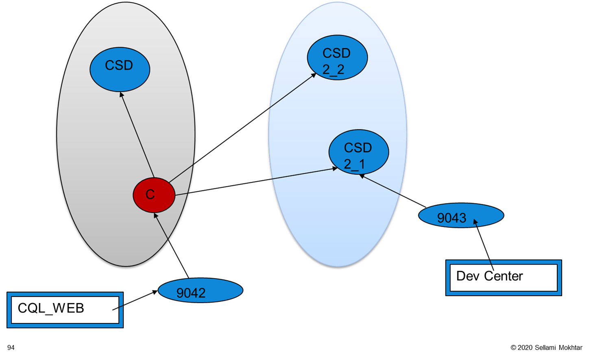

# 🐳 CQL Web Editor - Docker Workshop

Ce projet permet de lancer un **éditeur CQL web personnalisé** avec **Apache Cassandra** en utilisant **Docker Compose**.

👉 Solution **clé en main**, compatible **Windows, Linux et macOS (y compris Apple Silicon M1/M2/M3)**.

---

## 🎯 Objectifs

- Démarrer rapidement un éditeur CQL web sans dépendances locales
- Éviter les problèmes Java / ARM / Rosetta
- Fournir un environnement reproductible pour **TP, formations et démonstrations**

---

## 📦 Prérequis

- Docker **20+**
- Docker Compose **v2**
- Ports libres :
  - `8889` (CQL Web Editor UI)
  - `9042` (Cassandra)

Vérification :

```bash
docker --version
docker compose version
```

---

## 📁 Structure du projet

```text
.
├── docker-compose.yml
├── README.md
├── cql-scripts/
│   ├── README.md
│   └── sample.cql
└── gui-cql/
    ├── Dockerfile
    ├── main.py
    ├── requirements.txt
    ├── sample.cql
    └── templates/
        └── index.html
```

---

## ⬇️ Récupération du projet (Git)

Cloner le dépôt Git officiel de l’atelier :

```bash
git clone https://github.com/msellamiTN/Cassandra.git
cd Cassandra
```

---

## ▶️ Démarrage rapide

Dans le dossier du projet :

```bash
docker compose up -d --build
```

Vérifier l’état des services :

```bash
docker compose ps
```

Suivre les logs de l'éditeur CQL :

```bash
docker compose logs -f cql-gui
```

---

## 🌐 Accès à l'éditeur CQL Web

Ouvrir un navigateur :

```text
http://localhost:8889
```

---

## 🔌 Configuration de la connexion Cassandra (dans l'interface web)

1. Ouvrir l'onglet **Configuration**
2. Renseigner (valeurs par défaut déjà configurées) :

| Champ | Valeur |
|------|-------|
| Hosts | cassandra |
| Port | 9042 |
| Username | (vide) |
| Password | (vide) |
| Keyspace | (optionnel) |

1. **Test Connection**
1. **Save**

---

## 🧪 Test rapide (CQL)

Créer un notebook CQL et exécuter :

```sql
CREATE KEYSPACE demo
WITH replication = {'class':'SimpleStrategy','replication_factor':1};

USE demo;

CREATE TABLE users (
  id UUID PRIMARY KEY,
  name text,
  email text
);

INSERT INTO users (id, name, email)
VALUES (uuid(), 'Alice', 'alice@mail.com');

SELECT * FROM users;
```

---

## 📝 Gestion des scripts CQL

L'interface web permet de sauvegarder et charger des scripts CQL :

- **Sauvegarder** : Utilisez le bouton "Save Script" pour enregistrer votre code CQL
- **Charger** : Utilisez le bouton "Load Script" pour ouvrir un script existant
- **Scripts stockés** : Les fichiers sont sauvegardés dans le dossier `cql-scripts/` du projet
- **Persistance** : Les scripts sont conservés même après redémarrage des conteneurs

---

## 🛑 Arrêt de l’environnement

```bash
docker compose down
```

Arrêt + suppression des volumes :

```bash
docker compose down -v
```

---

## 🧠 Notes importantes

- L'application web est construite avec **FastAPI** et utilise le driver Python Cassandra
- L'interface permet l'exécution de requêtes CQL multiples (séparées par des points-virgules)
- Les résultats des SELECT sont affichés dans des tableaux HTML
- Navigation possible dans les keyspaces et tables via l'interface
- **Gestion des scripts** : Sauvegarde et chargement de scripts CQL dans le dossier monté

---

## 🏢 Déployer un vrai cluster Cassandra multi‑datacenter (2 DC)

Cette section décrit un déploiement **réel** (VM/serveurs) avec **2 datacenters** (ex: `dc1`, `dc2`).

Différence importante :

- **Docker Compose (TP)** : multi‑DC “logique” (même réseau Docker, même machine) pour apprendre la réplication/consistency.
- **Multi‑DC réel** : latence WAN, firewall, routing, contraintes d’exploitation (monitoring, backups, repairs).

### ✅ Prérequis

- 2 sites (ou 2 sous‑réseaux) : `dc1` et `dc2`
- Au moins **2 nœuds par DC** recommandé (ex: 2+2)
- Horloge synchronisée (**NTP/chrony**) sur toutes les machines
- DNS ou résolution stable des hostnames/IP

### 🔥 Ports réseau à ouvrir (entre nœuds Cassandra)

- `7000/tcp` (intra‑cluster)
- `7001/tcp` (intra‑cluster TLS si activé)
- `9042/tcp` (CQL)
- `7199/tcp` (JMX / nodetool)

### ⚙️ Configuration par nœud (snitch + DC/Rack)

1. Dans `cassandra.yaml` :

```yaml
endpoint_snitch: GossipingPropertyFileSnitch
```

1. Dans `cassandra-rackdc.properties` (un fichier par nœud) :

```properties
dc=dc1
rack=rack1
```

1. Toujours dans `cassandra.yaml`, vérifier/adapters selon ton réseau :

- `cluster_name` identique partout
- `listen_address` / `rpc_address`
- `broadcast_address` / `broadcast_rpc_address` (surtout en multi‑réseaux)

### 🌱 Seeds (recommandation multi‑DC)

- Définir **1–2 seeds par DC** (stables)
- Tous les nœuds doivent référencer la même liste de seeds

Exemple :

```yaml
seed_provider:
  - class_name: org.apache.cassandra.locator.SimpleSeedProvider
    parameters:
      - seeds: "10.10.0.11,10.20.0.11"
```

### ▶️ Démarrage

- Démarrer d’abord les seeds (un par DC), puis les autres nœuds
- Vérifier l’état du cluster :

```bash
nodetool status
```

Tu dois voir :

- `Datacenter: dc1` avec des nœuds `UN`
- `Datacenter: dc2` avec des nœuds `UN`

### 🧩 Keyspaces en multi‑DC (NetworkTopologyStrategy)

En multi‑DC, **éviter** `SimpleStrategy`.

Exemple (2 nœuds par DC) :

```sql
CREATE KEYSPACE IF NOT EXISTS atelier
WITH replication = {
  'class': 'NetworkTopologyStrategy',
  'dc1': 2,
  'dc2': 2
};
```

Exemple complet (CQL) basé sur ce modèle : `cql-scripts/covid.cql.txt`.

Important : les noms `dc1` / `dc2` doivent correspondre **exactement** à ceux du cluster (voir `nodetool status`).

### 🎛️ Consistency (bonnes pratiques)

- Lecture/écriture dans un DC : `LOCAL_QUORUM`
- Lecture rapide “tolérante” : `LOCAL_ONE` (risque de données moins fraîches)

Exemple :

```sql
CONSISTENCY LOCAL_QUORUM;
```

### ⚠️ Pièges fréquents

- Ne pas renommer un DC après initialisation : Cassandra bloque si le DC change (il faut rebootstrap/decommission).
- WAN latency : bien calibrer `read_request_timeout_in_ms`, `write_request_timeout_in_ms`, etc.
- Multi‑DC réel = penser **repairs** (ex: `nodetool repair` / incremental repairs) et supervision.

---

## 🚀 Extensions possibles

- Connexion **Astra DB** (Secure Connect Bundle)
- Atelier **CQL avancé**
- Comparaison avec outils modernes (Astra UI, cqlsh, notebooks)
- Intégration Kafka / Spark (legacy DSE)

---

## 📜 Licence

L'utilisation d'Apache Cassandra est soumise aux conditions de licence Apache 2.0.

---

👨‍🏫 *Document prêt pour atelier académique ou formation professionnelle.*

