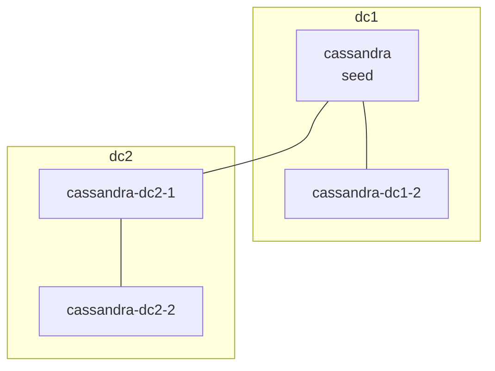

# Atelier complet — Cassandra multi‑DC (dc1/dc2) + CQL Web Editor + Fleet Dashboard (Streamlit)

Cet atelier te guide **pas à pas** pour démarrer et valider un cluster **Cassandra multi‑datacenter** (2 DC logiques via Docker Compose) et exploiter :

- l’éditeur **CQL Web** (FastAPI)
- le dashboard **Fleet IoT** (Streamlit)

Il est structuré en **2 volets** :

- **Volet A — ETL workshop** : génération de fausses données IoT et ingestion continue dans Cassandra.
- **Volet B — Dashboard workshop** : analytics “near‑realtime” sur les données Fleet via Streamlit.

L’objectif est d’obtenir un environnement fiable pour un workshop (démarrage reproductible, validations, dépannage).

---

## 0) Objectifs pédagogiques

- Comprendre ce qu’implique un cluster Cassandra **multi‑DC** (snitch, DC/Rack, seeds).
- Utiliser la réplication **NetworkTopologyStrategy** et choisir une stratégie de réplication cohérente.
- Exécuter des scripts CQL (création keyspaces/tables + inserts + requêtes) via UI et `cqlsh`.
- Mettre en place une boucle **ETL** (génération + ingestion) pour alimenter un cas d’usage.
- Visualiser/analyser des données IoT (devices, latest, alerts, telemetry) via Streamlit.

---

## 1) Architecture (vue d’ensemble)

```mermaid
flowchart LR
  subgraph B[Browser]
    U1[Utilisateur]
  end

  subgraph D[Docker Compose]
    GUI[CQL Web Editor\n(FastAPI :8000)]
    DASH[Fleet Dashboard\n(Streamlit :8501)]
    INIT[cassandra-init\n(one-shot)]

    subgraph DC1[Datacenter dc1]
      N1[cassandra\n(dc1/rack1)]
      N2[cassandra-dc1-2\n(dc1/rack2)]
    end

    subgraph DC2[Datacenter dc2]
      N3[cassandra-dc2-1\n(dc2/rack1)]
      N4[cassandra-dc2-2\n(dc2/rack2)]
    end
  end

  U1 -->|HTTP 8889| GUI
  U1 -->|HTTP 8501| DASH

  GUI -->|CQL 9042| N1
  GUI -->|CQL 9042| N3
  DASH -->|CQL 9042| N1
  DASH -->|CQL 9042| N3

  INIT -->|cqlsh| N1
```

Notes :

- **Multi‑DC “logique”** ici = tout est sur le même réseau Docker, mais Cassandra voit **2 DC distincts** (`dc1`, `dc2`).
- En production “vrai multi‑DC”, les DC seraient sur des réseaux différents (WAN, firewalls, latence, etc.).

---

## 2) Prérequis

- Docker + Docker Compose v2
- Ports libres sur ta machine :
  - `8889` (UI CQL)
  - `8501` (Streamlit)
  - `8888` (Jupyter)
  - `9042` (Cassandra — nœud dc1 principal)
  - `9043` (optionnel — exposé sur le nœud `cassandra-dc2-1` si tu veux tester depuis l’hôte)

---

## 3) Démarrage (clean start)

Depuis la racine du repo :

```bash
docker compose up -d --build
```

Remarque :

- Le service `fleet-etl` tourne en continu et génère des données (tu peux le stopper/redémarrer à la demande).

### Checkpoint ✅ — Les conteneurs tournent

```bash
docker compose ps
```

Attendu :

- `cql-gui-cassandra` (healthy)
- `cassandra-dc1-2`
- `cassandra-dc2-1`
- `cassandra-dc2-2`
- `cassandra-init` (terminé avec succès)
- `cql-gui-app`
- `fleet-dashboard`
- `fleet-etl`

---

## 4) Vérifier le cluster multi‑DC

### 4.1 — Vérifier l’état des nœuds

```bash
docker exec -it cql-gui-cassandra nodetool status
```

Checkpoint ✅ — Attendu (exemple)

- Une section `Datacenter: dc1` contenant 2 nœuds en `UN`
- Une section `Datacenter: dc2` contenant 2 nœuds en `UN`

### 4.2 — Vérifier que la snitch est correcte

Le `docker-compose.yml` configure :

- `CASSANDRA_ENDPOINT_SNITCH=GossipingPropertyFileSnitch`
- `CASSANDRA_DC` et `CASSANDRA_RACK` par nœud

C’est indispensable pour que Cassandra annonce les DC correctement.

---

## 5) Initialisation automatique du keyspace `atelier`

Au démarrage, le service **one‑shot** `cassandra-init` exécute :

- `cql-scripts/atelier.cql`
- `cql-scripts/atelier_fleet_schema.cql`

Contenu (résumé) :

- `CREATE KEYSPACE atelier WITH replication = {'class':'NetworkTopologyStrategy','dc1':2,'dc2':2}`
- Création des tables Fleet IoT (`devices_by_fleet`, `latest_telemetry_by_device`, `telemetry_by_device_day`, `alerts_by_fleet_day`, `telemetry_by_fleet_day`).

### Checkpoint ✅ — Le keyspace existe

```bash
docker exec -it cql-gui-cassandra cqlsh localhost 9042 -e "DESCRIBE KEYSPACES;"
```

Attendu : `atelier` apparaît dans la liste.

---

## 6) Accès aux interfaces

- UI CQL : <http://localhost:8889>
- Fleet Dashboard : <http://localhost:8501>
- Jupyter : <http://localhost:8888> (token = `my-token`)

---

## 7) Schéma Fleet IoT (tables)

Le dashboard Streamlit lit ces tables (dans le keyspace `atelier`) :

- `devices_by_fleet`
- `latest_telemetry_by_device`
- `telemetry_by_device_day`
- `alerts_by_fleet_day`

Le générateur ETL écrit aussi dans :

- `telemetry_by_fleet_day`

### 7.1 — Créer les tables (optionnel)

En principe, elles sont créées automatiquement par `cassandra-init`.

Si tu veux rejouer la création “à la main” (ou si tu as supprimé les volumes), ouvre l’UI CQL puis exécute :

```sql
USE atelier;

CREATE TABLE IF NOT EXISTS devices_by_fleet (
  fleet_id text,
  device_id text,
  model text,
  activated_at timestamp,
  PRIMARY KEY ((fleet_id), device_id)
);

CREATE TABLE IF NOT EXISTS latest_telemetry_by_device (
  device_id text PRIMARY KEY,
  last_ts timestamp,
  lat double,
  lon double,
  speed_kmh double,
  battery_pct int,
  temp_c double
);

CREATE TABLE IF NOT EXISTS telemetry_by_device_day (
  device_id text,
  day date,
  ts timestamp,
  lat double,
  lon double,
  speed_kmh double,
  battery_pct int,
  temp_c double,
  zone text,
  PRIMARY KEY ((device_id, day), ts)
) WITH CLUSTERING ORDER BY (ts DESC);

CREATE TABLE IF NOT EXISTS alerts_by_fleet_day (
  fleet_id text,
  day date,
  severity text,
  ts timestamp,
  device_id text,
  alert_type text,
  message text,
  PRIMARY KEY ((fleet_id, day, severity), ts, device_id)
) WITH CLUSTERING ORDER BY (ts DESC);

CREATE TABLE IF NOT EXISTS telemetry_by_fleet_day (
  fleet_id text,
  day date,
  ts timestamp,
  device_id text,
  lat double,
  lon double,
  speed_kmh double,
  battery_pct int,
  temp_c double,
  zone text,
  PRIMARY KEY ((fleet_id, day), ts, device_id)
) WITH CLUSTERING ORDER BY (ts DESC);
```

### 7.2 — Comprendre le design (mini‑explication)

- **devices_by_fleet** :
  - Partition = `fleet_id`
  - Clustering = `device_id`
  - Lecture rapide : “liste des devices d’une flotte”

- **telemetry_by_device_day** :
  - Partition = `(device_id, day)` → évite les partitions infinies
  - Clustering = `ts DESC` → “dernier point” très rapide

- **alerts_by_fleet_day** :
  - Partition = `(fleet_id, day, severity)`
  - Clustering = `ts DESC` puis `device_id`

---

## 8) Seed minimal (données de test)

Si `fleet-etl` tourne, tu peux sauter cette partie (les données seront générées automatiquement).

Exécute dans l’UI CQL :

```sql
USE atelier;

INSERT INTO devices_by_fleet (fleet_id, device_id, model, activated_at)
VALUES ('FLEET_PARIS','BUS-001','GPS-TX-1','2025-12-01 08:00:00+0000');

INSERT INTO devices_by_fleet (fleet_id, device_id, model, activated_at)
VALUES ('FLEET_PARIS','BUS-002','GPS-TX-1','2025-12-01 08:05:00+0000');

INSERT INTO devices_by_fleet (fleet_id, device_id, model, activated_at)
VALUES ('FLEET_LYON','TRUCK-017','GPS-TX-2','2025-12-05 09:00:00+0000');

INSERT INTO telemetry_by_device_day (device_id, day, ts, lat, lon, speed_kmh, battery_pct, temp_c, zone)
VALUES ('BUS-001','2025-12-17','2025-12-17 20:00:00+0000',48.8566,2.3522,32.5,88,36.2,'PARIS-A');

INSERT INTO telemetry_by_device_day (device_id, day, ts, lat, lon, speed_kmh, battery_pct, temp_c, zone)
VALUES ('BUS-001','2025-12-17','2025-12-17 20:05:00+0000',48.8570,2.3530,35.2,87,36.4,'PARIS-A');

INSERT INTO telemetry_by_device_day (device_id, day, ts, lat, lon, speed_kmh, battery_pct, temp_c, zone)
VALUES ('BUS-001','2025-12-17','2025-12-17 20:10:00+0000',48.8580,2.3542,10.1,86,41.8,'PARIS-A');

INSERT INTO latest_telemetry_by_device (device_id, last_ts, lat, lon, speed_kmh, battery_pct, temp_c)
VALUES ('BUS-001','2025-12-17 20:10:00+0000',48.8580,2.3542,10.1,86,41.8);

INSERT INTO alerts_by_fleet_day (fleet_id, day, severity, ts, device_id, alert_type, message)
VALUES ('FLEET_PARIS','2025-12-17','HIGH','2025-12-17 20:10:00+0000','BUS-001','TEMP_HIGH','Température > 40C');
```

### Checkpoint ✅ — Requêtes de validation

```sql
USE atelier;
SELECT * FROM devices_by_fleet WHERE fleet_id='FLEET_PARIS';
SELECT * FROM latest_telemetry_by_device WHERE device_id='BUS-001';
SELECT * FROM telemetry_by_device_day WHERE device_id='BUS-001' AND day='2025-12-17' LIMIT 10;
SELECT * FROM alerts_by_fleet_day WHERE fleet_id='FLEET_PARIS' AND day='2025-12-17' AND severity='HIGH' LIMIT 10;
```

---

## 9) Utiliser le Fleet Dashboard (Streamlit)

Ouvre : <http://localhost:8501>

Le dashboard propose 2 usages :

- **Exploration** : onglets `Devices`, `Latest`, `Alerts`, `Telemetry`.
- **Volet B — Realtime analytics** : onglet `Realtime Analytics` (flotte + KPIs + positions + distribution vitesses).

### 9.1 — Onglet Devices

- Entre `fleet_id = FLEET_PARIS`
- Attendu : `BUS-001`, `BUS-002`

### 9.2 — Onglet Latest

- Entre `device_id = BUS-001`
- Attendu : 1 ligne (dernier point)

### 9.3 — Onglet Alerts

- `fleet_id = FLEET_PARIS`
- `day = 2025-12-17`
- `severity = HIGH`

### 9.4 — Onglet Telemetry

- `device_id = BUS-001`
- `day = 2025-12-17`

### 9.5 — Onglet Realtime Analytics (Volet B)

Cet onglet lit `telemetry_by_fleet_day` pour une flotte/jour donnés.

1. Mets `fleet_id = FLEET_PARIS`
1. Mets `day = (aujourd'hui)`
1. Clique `Refresh`

Attendu :

- KPIs (devices vus, nombre de lignes, timestamps)
- Distribution des vitesses
- Carte avec les dernières positions (1 point par device)

---

## Volet A — ETL workshop (génération + ingestion)

Le service `fleet-etl` génère des points de télémétrie et les insère dans Cassandra :

- 2 flottes par défaut : `FLEET_PARIS`, `FLEET_LYON`
- N devices par flotte (`ETL_DEVICES_PER_FLEET`)
- Une cadence (`ETL_INTERVAL_MS`)

### A1) Démarrer / arrêter l’ETL

```bash
docker compose stop fleet-etl
docker compose up -d fleet-etl
```

### A2) Suivre les logs

```bash
docker logs -f fleet-etl
```

### A3) Valider l’ingestion côté Cassandra

Dans l’UI CQL (ou via `cqlsh`) :

```sql
USE atelier;

SELECT *
FROM telemetry_by_fleet_day
WHERE fleet_id='FLEET_PARIS'
  AND day='YYYY-MM-DD'
LIMIT 20;
```

Remplace `YYYY-MM-DD` par la date du jour (celle utilisée dans Streamlit).

---

## 10) Exercice bonus — Keyspace multi‑DC `covid19`

Ce repo contient `cql-scripts/covid.cql.txt` comme exemple **multi‑DC** (NetworkTopologyStrategy).

Exécution depuis l’hôte :

```bash
docker exec -i cql-gui-cassandra cqlsh localhost 9042 < cql-scripts/covid.cql.txt
```

Checkpoint ✅ :

```bash
docker exec -it cql-gui-cassandra cqlsh localhost 9042 -e "DESCRIBE KEYSPACE covid19;"
```

---

## 11) Consistency (mini‑manip)

Dans `cqlsh` :

```sql
CONSISTENCY;
CONSISTENCY QUORUM;
```

Rappel (très simplifié) :

- `LOCAL_QUORUM` se limite à un DC (souvent recommandé en multi‑DC)
- `QUORUM` implique plusieurs DC si la réplication est multi‑DC

---

## 12) Dépannage (les 4 pannes les plus fréquentes)

### 12.1 — Erreur “DC mismatch” après changement de `CASSANDRA_DC`

Cause : Cassandra persiste des métadonnées dans le volume. Si tu changes `dc1`→`dc2` après coup, le nœud refuse de démarrer.

Fix (⚠️ supprime les données) :

```bash
docker compose down -v
```

Puis redémarrer.

### 12.2 — Seeds mal configurés

Symptômes : un nœud ne rejoint pas le cluster, ou logs de gossip/seed.

Règle simple :

- Choisir 1–2 seeds stables.
- Tous les nœuds pointent vers **la même liste**.

### 12.3 — `atelier` absent / dashboard en erreur

Vérifie :

```bash
docker compose ps
```

- `cassandra-init` doit être “completed successfully”.

Puis :

```bash
docker exec -it cql-gui-cassandra cqlsh localhost 9042 -e "DESCRIBE KEYSPACES;"
```

### 12.4 — Port `9043`

- `9042` = cassandra (dc1 principal) exposé sur l’hôte
- `9043` = `cassandra-dc2-1` exposé sur l’hôte (optionnel)

À l’intérieur de Docker, on continue d’utiliser `cassandra-dc2-1:9042`.

---

## 13) Figure — Topologie multi‑DC (vue “cluster”)



---

## 14) Aller plus loin (prod “vrai multi‑DC”)

Pour une mise en place sur VMs/serveurs (WAN), voir la section **"Déployer un vrai cluster Cassandra multi‑datacenter (2 DC)"** dans le `README.md` à la racine.
